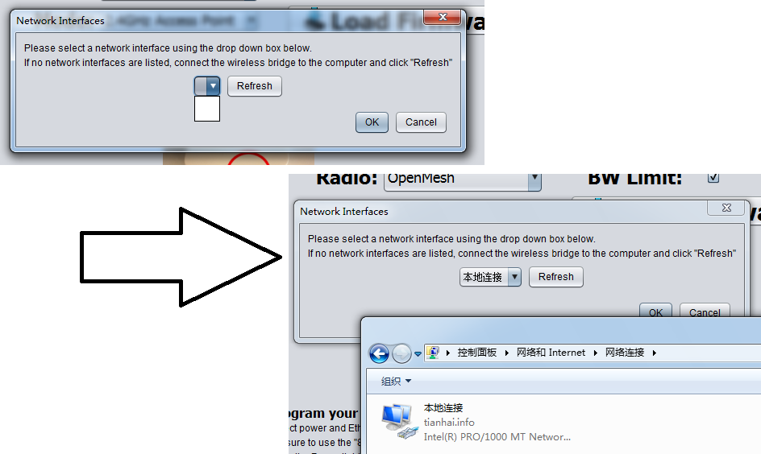
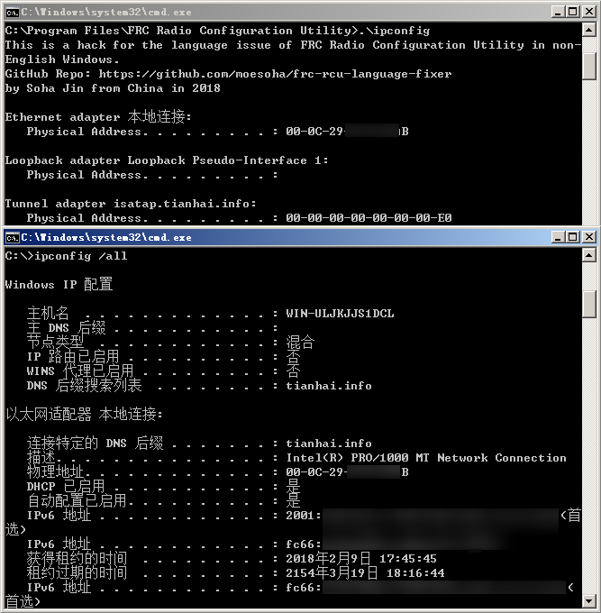

# FRC Radio Configuration Utility Language Fixer

A hack which solves the interface selection issue in non-English Windows.

### How To Use

[Download the release](https://github.com/moesoha/frc-rcu-language-fixer/releases), copy the Fixer to the installation directory(such as `C:\Program Files (x86)\FRC Radio Configuration Utility\`) and rename it to `ipconfig.exe`. The Configuration Utility will use the Fixer as `ipconfig.exe`. 

Then run FRC Radio Configuration Utility as usual.

### How Does It Work?

FRC Radio Configuration Utility uses the command `ipconfig /all` to list all interfaces can be used to flash the radio; however, if you want to run the command in Windows with other languages such as Chinese, Spanish or Japanese, it will return the result in that language. That causes the problem.

The program mocks what the `ipconfig /all` do, and made it simpler. Because the Fixer will always returns an English content like `Ethernet adapter 以太网:`, the Utility will show `以太网`, and use this name for further configuration.

The system-wide codepage is not changed, therefore you needn't to change the interface name to English.

### Requirements

.NET Framework 2.0 *(included in Windows 7 and above)*

----------

*Thanks to Team 6971, they are the first one tested this on Chinese Windows 7/10.*